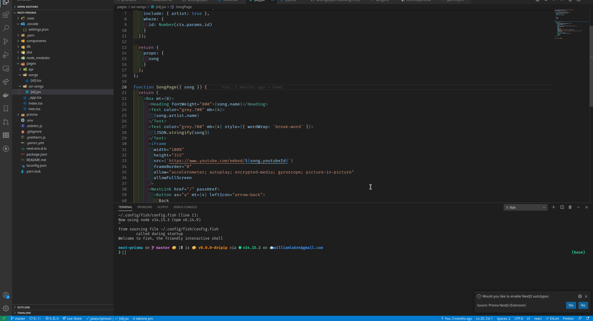
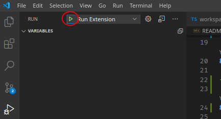

# Prisma-Nextjs

## Features

Automagicly add types to **nextjs** page functions i.e `getStaticSideProps`, `getServerSideProps` the returned types can not be automatically inferred and passed to the page. 

This extension also enables type safety in js code by leveraging JSDOCs

<br/>

<p align="center">
  
</p>

## Requirements

A Project with next as a dependency in your `package.json`

## Extension Settings

| Name                             | Description                                 | Default |
| -------------------------------- | ------------------------------------------- | ------- |
| `WillLuke.nextjs.root`           | Option to set the path to a nextjs project  |         |
| `WillLuke.nextjs.hasPrompted`    | Hides Autotypes Prompt if it has been shown | `false` |
| `WillLuke.nextjs.addTypesOnSave` | Automatically add NextJS page types on save | `false` |
| `WillLuke.debug`                 | Debug the Extension                         | `false` |

## Known Issues

- Workspaces not Supported

## Development

### Installing

```bash
git clone https://github.com/prisma-labs/vscode-next.git
cd vscode-next
yarn
```

### Debugging/Developing

Use VSCode built in debugger and select Run Extension

<p align="center">
  
</p>

### Packaging

```bash
yarn pkg
```
